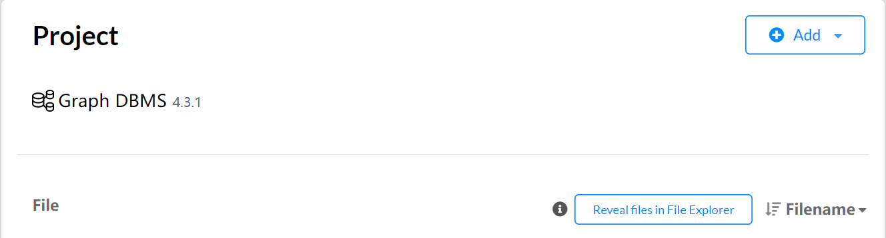
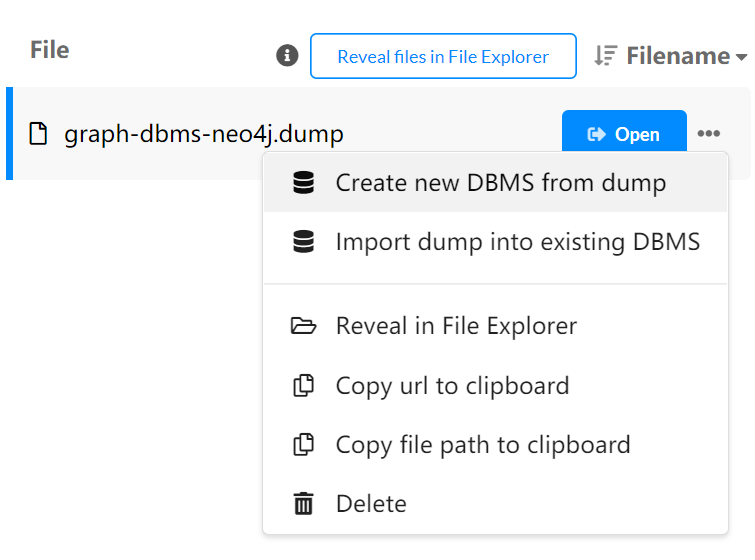
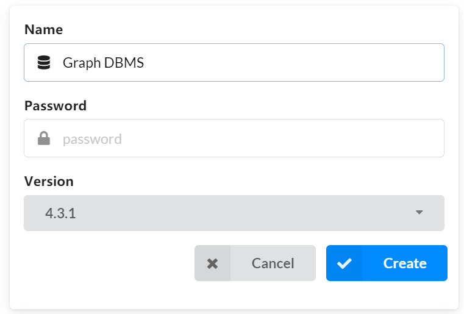
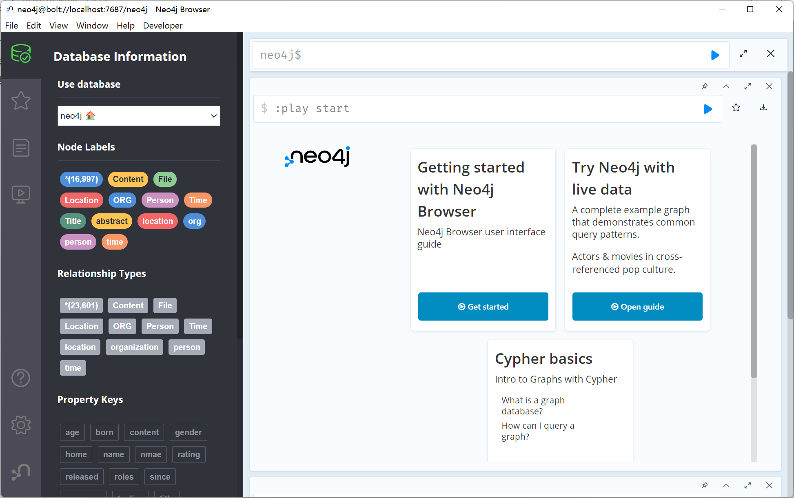
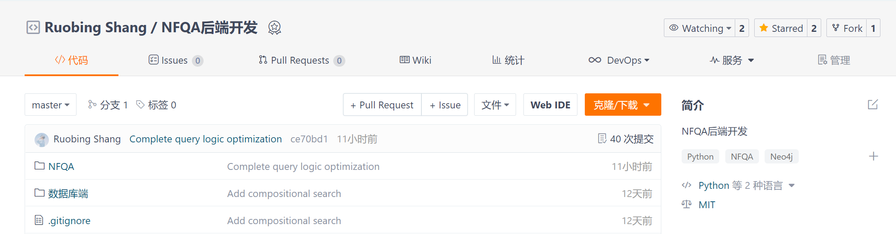
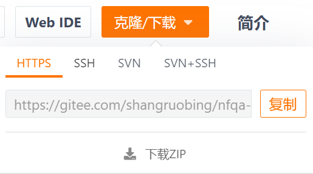
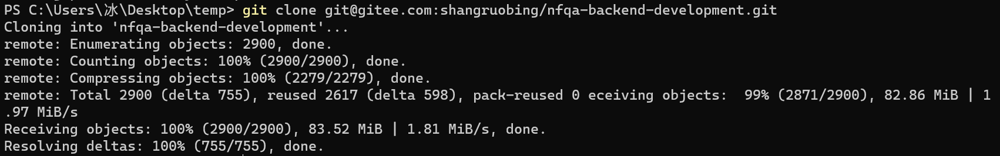
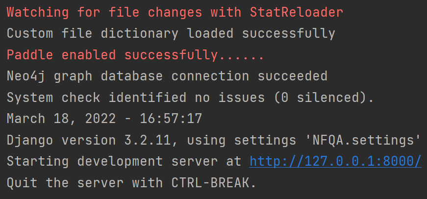
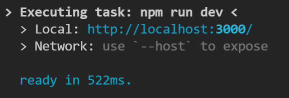
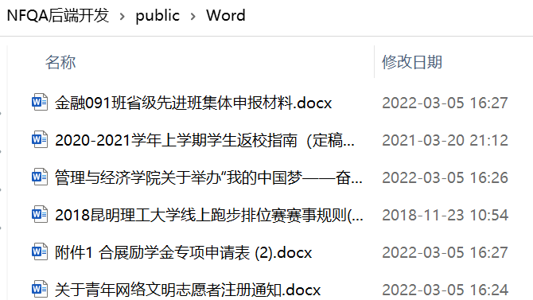

# NFQA 开发环境部署文档

**基于 BERT 和知识推理的校园通告/通知智能问答系统**

## 修订记录

| 时间      | 版本 | 作者   | 备注           |
| --------- | ---- | ------ | -------------- |
| 2022.3.18 | V1.0 | 尚若冰 | 编写第一版文档 |
| 2022.3.20 | V1.2 | 尚若冰 | 修改了文档结构 |
| 2022.3.22 | V1.5 | 尚若冰 | 订正部分错误   |

## 目录

[TOC]

## 文件清单

| 文件名称              | 作用                                  | 备注                              |
| --------------------- | ------------------------------------- | --------------------------------- |
| graph-dbms-neo4j.dump | neo4j 的数据文件                      |                                   |
| ~~mydict.txt~~        | jieba 的自定义字典                    | **_已上传至 Gitee,无需手动安装_** |
| qas_notice.sql        | mysql 的通知表插值语句                |                                   |
| Word.zip              | word 文件合集，有 1K 个左右的通知文件 |                                   |

## 部署说明

**NFQA 由前端+后端+数据库+文件资源组成，请按照接下来的步骤进行安装使用。**

- 前端:Vue3 Element-Plus Vite Vue-Router
- 后端:Django Django-Rest-Framework
- 数据库:MySQL Neo4j(Graph Database）
- 文件资源:自定义词典 Word 文件

### Neo4j

Neo4j 的数据文件为:graph-dbms-neo4j.dump _详见文件清单_

安装步骤：

1. 首先点击 Project 中的 Reveal files in File Explorer 按钮打开数据文件目录，将 Neo4j 的数据文件(.dump)拷贝至该目录，之后在软件界面可见 Project-File 包含数据文件
2. 点击蓝色 Open 按钮右边的省略号，Create new DBMS from dump
3. 在配置好用户名和密码后，点击 Create，图数据库初始化完成
   
4. 之后的使用，在 Project 中点击 Start，当数据库显示如下(ACTIVE)，代表成功运行
5. 点击蓝色按钮 Open，打开图数据库浏览器，看到如下界面，恭喜你完成图数据库的安装 🎉🎉

### Django 后端

准备步骤：

1. 安装 Git bash，并配置相应的用户名和邮箱以及**环境变量**⚠
   参考文档:[Git 安装配置|菜鸟教程 (runoob.com)](https://www.runoob.com/git/git-install-setup.html)

   ```
   git config --global user.name "Your Name"
   git config --global user.email "Your Email"
   ```

2. 注册一个 Gitee 账号(可以把它看作中国版的 Github)

3. 点击右端的 Fork 按钮，Fork 后端项目

   项目链接:[NFQA 后端开发](https://gitee.com/shangruobing/nfqa-backend-development)

4. 点击橙色的克隆/下载按钮，复制仓库的 HTTPS 或 SSH 的地址

   

5. 在想要安装后端项目的文件夹下，打开 CMD 输入 git clone + 刚刚复制的项目地址

   ```shell
   git clone git@gitee.com:shangruobing/nfqa-backend-development.git
   ```

6. 稍等片刻，出现下图，代表成功！可以发现，Git 仓库中的 Project 已经 Clone 到我们的计算机当中

7. 接下来我们需要配置 Python 环境，安装第三方依赖包，使用 Pycharm 打开后端项目，可以看到项目目录中含有一个 requirements.txt 文件，这个文件用来记录 Python 环境需要的依赖包。
   **我们可以通过如下命令安装所有的项目依赖**，如果有该文件未记录的依赖，请及时与我反馈。

   ```shell
   pip install -r requirements.txt
   ```

8. 打开终端，切换到后端的 APP 目录，完成 Django 的模型迁移

   ```
   python manage.py makemigrations
   ```

   ```
   python manage.py migrate
   ```

   #### 注意事项

   ⚠**需要把 settings.py 文件中的 MySQL 用户和密码改为自己的用户名和密码**

   ```python
   DATABASES = {
       'default':
           {
               'ENGINE': 'django.db.backends.mysql',  # 数据库引擎
               'NAME': 'NFQA',  # 数据库名称
               'HOST': '127.0.0.1',  # 数据库地址，本机 ip 地址 127.0.0.1
               'PORT': 3306,  # 端口
               'USER': 'root',  # 数据库用户名
               'PASSWORD': 'Your Password',  # 数据库密码
           }
   }
   ```

   ⚠**需要把 views.py 文件中的 neo4j 连接的 auth 改为自己的用户名和密码**

   ```python
   try:
       graph = Graph("http://localhost:7474", auth=("neo4j", "010209"))
       print("Neo4j graph database connection succeeded")
   except py2neo.errors.ConnectionUnavailable:
       raise APIException("Neo4j graph database connection failed")
   ```

9. 使用下述命令启动 Django，出现下图结果，代表 Django 成功启动，至此 Django 安装完成，恭喜 🎉

   ```shell
   python manage.py runserver
   ```



### MySQL

MySQL 的数据文件为:qas*notice.sql *详见文件清单\_

安装步骤:

1. 安装好 MySQL 数据库
2. 安装数据库管理器 Navicat(可选，推荐)
3. 在 Navicat 或 MySQL Workbench 中执行 qas_notice.sql 中的 SQL 语句

### Vue 前端

1. 安装 Node.js ⚠ 需要配置环境变量

   参考链接：[Download Node.js](https://nodejs.dev/download)

2. 点击右端的 Fork 按钮，Fork 前端项目

   项目链接：[NFQA 前端开发](https://gitee.com/shangruobing/nfqa-front-end-development)

3. 按照之前介绍后端的流程，将前端项目 Clone 到本地

4. 切换到项目目录，使用如下命令安装前端依赖包

   ```shell
   npm install
   ```

   ⚠ 注意 npm 可能下载速度会很慢，可以考虑换源为淘宝镜像，命令如下

   ```shell
   npm install -g cnpm --registry=https://registry.npm.taobao.org
   ```

   之后使用下述命令安装前端依赖包

   ```shell
   cnpm install
   ```

5. 依赖安装完成后，使用如下命令,运行 Vite 服务器

   ```shell
   npm run dev
   ```

6. 出现如下界面，恭喜，前端安装完成并且成功启动!🎉



### Word 文件部署

⚠**Word 文件资源不存在，只会影响文件预览功能，不影响系统运行**

Word 的数据文件为：Word 合集.zip \*详见文件清单

将 Word 合集解压至 后端项目/public/Word 文件夹下即可



---

## 运行说明

**_在成功完成所有步骤后，便可以正式体验我们的问答机器人啦！_**🎉

启动步骤：

1. 启动图数据库 neo4j

2. 启动 MySQL 服务

3. 启动 Django 服务器

   ```shell
   python manage.py runserver
   ```

4. 启动 Vite 服务器

   ```shell
    npm run dev
   ```

5. 体验并及时记录、反馈 🎉🎉

## 目前存在的问题

- 部分电脑，百度 Paddle 模型无法运行，从而会导致 jieba 的语义识别出问题

  参数如下:paddlepaddle-tiny==1.6.1

  日志如下:

  ```
  PaddleCheckError: Cannot open file C:\Users\吴翰芃\AppData\Local\Programs\Python\
  Python37\lib\site-packages\jieba\lac_small\model_baseline\word_emb for load op at [D:\paddle-tiny-release-liujinquan\1.6.1-tiny\Paddle\paddle/fluid/operators/
  load_op.h:37]
  [operator < load > error]
  ```

  解决办法:用管理员模式执行 Django 的启动脚本
