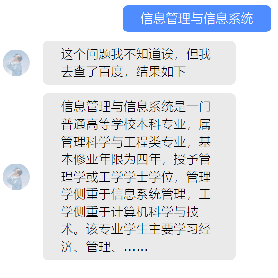

# _Notice File Question & Answer_

**基于 BERT 和知识推理的校园通告/通知智能问答系统**

[TOC]

## 项目概述

​ 建立一个针对学校新近发布的通告和通知的智能问答系统，能够自动识别和理解用户提出的关于通告和通知的疑问，并自动给出比较满意的答案，来解决通告和通知在下发过程中传达效率低、理解不到位、咨询工作量大等棘手问题。

## 方案和技术路线

​ 利用通知公告文件构建知识库，将知识库存入 Neo4j 图数据库，将 BERT 模型结合知识库进行参数微调，通过编写 B/S 应用，使用户能通过文字，语音与模型进行交互，应用将通过自然语言处理技术理解用户问题，通过检索知识库给出答案，用户亦能通过应用对答案进行评价，从而继续训练模型。

### 查询逻辑

## 项目进度

可以在聊天框对机器人进行对话，当询问的通知文件被检索到时，可以点击消息预览及下载文件。

系统可以根据自然语言处理中的实体识别和语义分析，自动、批量地将通知文件转换为如下的图：

**_目前我们数据库中含有管理与经济学院近 10 年来的 1032 篇通知文件，具有 16997 个结点和 23601 个关系_**

## 使用案例

主要界面如下：

- 打开网页进入到系统的主界面点击机器人按钮，进入到问答界面
- 在聊天框输入提问的语句，进行提问
- 输入问题后得到的回答有三种来源

### 查询示例

#### 时间代词查询（今天，明天，今年，去年）

#### MySQL 查询

提问涉及到文件名称，如《“我爱昆工”校园文化创意产品设计大赛》，系统在字典中匹配到该项目，则直接进入 MySQL 查询并返回。

#### Neo4j 查询

提问没有涉及文件名称，则进入图数据库端的查询，利用 jieba 进行语义分析，同时生成 Cypher 查询语句。

#### 查询失败，未能识别问题

#### 输入的文件名不准确或数据库中没有该文件未得到结果

#### 非法输入

#### 百度百科搜索

### 预览功能

